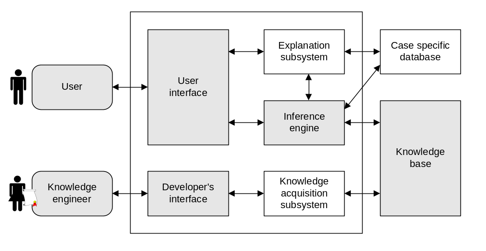

# Hệ hỗ trợ suy luận luật thừa kế Việt Nam

Đồ án xây dựng một hệ thống dựa trên tri thức nhằm hỗ trợ xác định các yếu tố trong luật thừa kế Việt Nam. Hệ thống biểu diễn tri thức pháp lý bằng **facts**, **production rules** và thực hiện suy luận tiến (**forward chaining**) bằng CLIPS.

> **Lưu ý:** Đây là đồ án phục vụ học tập và sử dụng nội bộ bởi nhóm phát triển. Knowledge base hiện chưa được chuyên gia pháp lý kiểm chứng hoặc phê duyệt. Kết quả của hệ thống không phải tư vấn pháp lý và không nên được sử dụng để đưa ra quyết định trong vụ việc thực tế.

## Mục tiêu

- Biểu diễn tường minh các chủ thể, quan hệ, sự kiện và điều kiện pháp lý trong lĩnh vực thừa kế.
- Tách tri thức pháp luật dùng chung khỏi dữ kiện của từng vụ việc.
- Suy luận bằng production rules có định danh và căn cứ điều luật; bảng phân loại, quan hệ và thứ tự được giữ thành knowledge facts khi phù hợp.
- Trình bày kết luận cùng chuỗi rules và facts đã được sử dụng.
- Phân biệt được kết luận `TRUE`, `FALSE`, `UNKNOWN` và `CONFLICT`.
- Cho phép mở rộng knowledge base mà không sửa mã nguồn inference engine.

Hệ thống **không sử dụng LLM** trong quá trình nhập liệu, suy luận hoặc giải thích kết quả.

## Kiến trúc



Kiến trúc của đồ án gồm hai luồng chính:

1. Thành viên nhóm nhập dữ kiện vụ việc qua giao diện; CLIPS suy luận và explanation subsystem trình bày kết quả.
2. Kỹ sư tri thức chuyển hóa nội dung pháp luật thành facts, templates và rules trong knowledge base.

Hai loại dữ liệu được tách biệt:

- **Knowledge base:** tri thức pháp lý dùng chung, được lưu dưới dạng các tệp `.clp`.
- **Case-specific database:** facts và kết quả của từng vụ việc, dự kiến được lưu bằng SQLite.

Kiến trúc triển khai mục tiêu:

```text
Next.js + TypeScript
├── App Router                 # Giao diện người dùng
├── Route Handlers             # Backend API nội bộ
├── Application services       # Điều phối các use case
├── CLIPS adapter              # Gọi CLIPS native process
├── SQLite                     # Case-specific database
└── knowledge-base/*.clp       # Templates và production rules
```

Ứng dụng dự kiến được self-host bằng Node.js hoặc Docker. Next.js Route Handlers đảm nhiệm backend API.

Các nhóm luật được tổ chức thành mô-đun kết quả dùng chung working memory, không phải các chuỗi xử lý độc lập. Registry tại `src/domain/analysis-modules.ts` khai báo result predicate, kiểu interaction, dependency và runtime adapter. Dependency chưa review mang trạng thái `draft` và không được execution planner tự động chạy.

`ModuleWorkspace` chọn presenter theo Module ID, vì vậy mô-đun tính hợp pháp có thể dùng questionnaire trong khi hàng thừa kế/thế vị dùng family tree và thời hiệu dùng timeline. Interaction rules chỉ điều khiển UI; kết luận pháp lý vẫn do CLIPS tạo ra.

## Trạng thái hiện tại

Đã hoàn thành vertical slice đầu tiên cho mô-đun đánh giá tính hợp pháp cơ bản của di chúc:

- [x] Chuyển rule-base từ DOCX sang Markdown.
- [x] Định nghĩa fact contracts dùng chung trong CLIPS.
- [x] Triển khai R-B01–R-B09 bằng forward chaining.
- [x] Sinh kết luận trung gian, kết quả mô-đun và inference trace.
- [x] Kiểm thử trường hợp hợp lệ, không hợp lệ và thiếu dữ kiện.
- [x] Kiểm thử các trường hợp đặc biệt R-B05–R-B09.
- [x] Khởi tạo ứng dụng Next.js full-stack.
- [x] Xây dựng TypeScript CLIPS adapter và API suy luận đầu tiên.
- [x] Tích hợp SQLite và lưu snapshot của mỗi lần suy luận.
- [x] Xây dựng prototype workspace nhập facts và xem giải thích.
- [x] Hoàn thiện danh sách vụ việc và lịch sử các lần suy luận cơ bản.
- [x] Triển khai mô-đun loại thừa kế R-A01–R-A06 theo từng phần di sản, gồm cả các rule `TEAM_REVIEW` ở trạng thái draft.
- [x] Thêm, sửa và xóa nhiều phần di sản với kết quả riêng từng phần.
- [x] Triển khai mô-đun quyền hưởng R-D01–R-D05 theo từng người dựa trên Điều 621.
- [x] Triển khai graph gia đình và R-C01–R-C06: phân loại ba hàng, chọn hàng hoạt động và gọi hưởng có kiểm soát completeness.
- [x] Triển khai lát cắt thừa kế thế vị R-E01/R-E02 trên graph dùng chung, gồm API, presenter rà soát nhánh, trace và tests.
- [x] Triển khai R-I01–R-I05 về thanh toán, nguyên tắc chia và hạn chế phân chia tại Điều 658–661.
- [x] Triển khai R-J01–R-J07 về thời hiệu, timeline và hậu quả sau thời hiệu theo Điều 623.
- [ ] So sánh hai inference runs của cùng hồ sơ (hạng mục hậu MVP).

## Phạm vi kết quả

Hệ thống không tính toán việc phân chia toàn bộ di sản theo một quy trình end-to-end. Kết quả được chia thành các mô-đun độc lập:

1. Tính hợp pháp của di chúc.
2. Loại thừa kế.
3. Quyền hưởng di sản.
4. Hàng thừa kế.
5. Thừa kế thế vị.
6. Suất bắt buộc.
7. Từ chối nhận di sản và tài sản không có người nhận.
8. Thanh toán nghĩa vụ di sản.
9. Thời hiệu.

Phiên bản trình bày tối thiểu hướng tới mô-đun 1–4. Mức mục tiêu bổ sung mô-đun thừa kế thế vị; các mô-đun còn lại được thực hiện nếu còn thời gian.

## Yêu cầu môi trường hiện tại

- CLIPS 6.x.
- Git.
- Ubuntu/Pop!_OS hoặc môi trường có thể chạy CLIPS.
- Node.js 20.9 trở lên.
- npm.
- LibreOffice (chỉ cần khi chạy `npm run law:extract`).

## Cài đặt CLIPS

Trên Ubuntu hoặc Pop!_OS:

```bash
sudo apt update
sudo apt install clips
```

Kiểm tra bằng bộ test hiện có:

```bash
npm test
```

Kết quả mong đợi:

```text
PASS will-valid
PASS will-invalid
PASS will-unknown
PASS will-conflict
PASS will-unresolved-rule-path
PASS will-minor-valid
PASS will-minor-invalid
PASS will-accessibility-valid
PASS will-oral-valid-boundaries
PASS will-oral-automatically-revoked
PASS domain-independent-from-analysis-request
```

## Chạy ví dụ suy luận

```bash
clips -f2 knowledge-base/run-fixture.clp
```

Ví dụ hợp lệ hiện tạo chuỗi suy luận:

```text
Facts đầu vào
  → R-B01: điều kiện về ý chí hợp lệ
  → R-B02: điều kiện về nội dung và hình thức hợp lệ
  → R-B03: di chúc hợp pháp
  → module-result + inference-trace
```

Để đổi fixture đang chạy, sửa đường dẫn `load-facts` trong `knowledge-base/run-fixture.clp` thành một trong các tệp:

- `knowledge-base/fixtures/will-valid.clp`;
- `knowledge-base/fixtures/will-invalid.clp`;
- `knowledge-base/fixtures/will-unknown.clp`;
- `knowledge-base/fixtures/will-minor-valid.clp`;
- `knowledge-base/fixtures/will-minor-invalid.clp`;
- `knowledge-base/fixtures/will-accessibility-valid.clp`;
- `knowledge-base/fixtures/will-oral-valid.clp`;
- `knowledge-base/fixtures/will-oral-revoked.clp`.

## Chạy ứng dụng web

```bash
npm install
npm run dev
```

Giao diện tại `/` là một reasoning workspace responsive, gồm:

- question flow dạng answer cards, thay đổi theo loại di chúc và facts đã nhập;
- working memory bằng tiếng Việt, có thể bật chế độ kỹ thuật để xem predicate/value;
- kết luận bốn trạng thái và danh sách dữ kiện còn thiếu;
- luồng lập luận tiếng Việt theo cấu trúc dữ kiện → rule → kết luận;
- mỗi bước chỉ rõ điều, khoản, điểm đang áp dụng và mở được toàn văn trong dialog;
- chế độ kỹ thuật mới hiển thị predicate, value và supports;
- lưu case, facts và inference snapshot vào SQLite khi chạy CLIPS.

Nội dung Điều 621, 627, 629, 630, 649, 650 và 651 hiển thị trong dialog được đọc từ catalog JSON đã trích xuất từ `doc/Luat_ThuaKe.doc`. Phần liên quan trực tiếp tới rule được đánh dấu “Rule đang sử dụng”, đồng thời dialog cung cấp liên kết đối chiếu văn bản trên Cổng Thông tin điện tử Chính phủ. Quy tắc chuyển tiếp nội bộ được ghi rõ là quy tắc kỹ thuật, không được trình bày như một điều luật.

### Trích xuất và lưu trữ điều luật

Văn bản đã chuẩn hóa được lưu tại `knowledge-base/legal-sources/civil-code-2015.inheritance.json`. Mỗi điều, khoản và điểm có một ID ổn định như `article-630` và `clause-1-a`; rule và UI chỉ tham chiếu các ID này nên không cần đọc lại file Word ở runtime.

Để tái tạo catalog từ tài liệu nguồn sau khi `doc/Luat_ThuaKe.doc` thay đổi:

```bash
npm run law:extract
```

Lệnh sử dụng LibreOffice ở chế độ headless để chuyển `.doc` sang text, tách Điều 621, 627, 629, 630 và 649–654, chuẩn hóa các khoản/điểm rồi ghi lại JSON. Trường `sourceSha256` giúp nhận biết chính xác phiên bản tài liệu nguồn đã được trích xuất. Sau khi chạy, cần review diff của catalog và chạy `npm test` trước khi chấp nhận thay đổi pháp lý.

Trong TypeScript có thể truy xuất trực tiếp bằng `getLegalProvision("article-630")` hoặc `getLegalSection("article-630", "clause-1-a")` từ `src/domain/legal-knowledge.ts`.

UI sử dụng Tailwind CSS và các shadcn source components trong `src/components/ui`. Hàm `cn()` kết hợp `clsx` với `tailwind-merge` để xử lý class variants.

Trang `/modules` đọc module registry và hiển thị các mục tiêu phân tích cùng kiểu interaction dự kiến. Năm presenter đã triển khai là `will-validity`, `inheritance-type`, `eligibility`, `heir-rank` và `representation`; mỗi mô-đun có cách nhập và trình bày kết quả riêng. Presenter `representation` rà soát các nhánh trong graph của một hồ sơ có sẵn thay vì tạo cây quan hệ thứ hai.

Trang gốc `/` chuyển hướng tới `/cases`, là điểm vào chính để quản lý hồ sơ trong SQLite. `/cases/:caseId` hiển thị facts hiện tại, mô-đun có thể chạy và lịch sử inference runs; `/cases/:caseId/runs/:runId` mở snapshot bất biến cùng trace và căn cứ pháp lý. Khi mở lại `will-validity`, presenter khôi phục answers từ facts đã lưu thay vì tạo một case mới. Người dùng có thể xóa hồ sơ từ danh sách hoặc trang chi tiết sau bước xác nhận; thao tác xóa đồng thời facts và toàn bộ inference snapshots liên quan.

API đầu tiên nhận dữ kiện đã chuẩn hóa tại `POST /api/inference/will-validity`. Ví dụ request tối thiểu cho một di chúc bằng văn bản:

```json
{
  "caseId": "case-demo",
  "subject": "will-demo",
  "facts": [
    { "id": "type", "predicate": "will-type", "value": "written" },
    { "id": "mental", "predicate": "testator-mental-state", "value": "lucid" },
    { "id": "influence", "predicate": "undue-influence", "value": "none" },
    { "id": "content", "predicate": "prohibited-content", "value": "not-detected" },
    { "id": "form", "predicate": "formal-defect", "value": "not-detected" }
  ]
}
```

Response gồm `results`, `missing` và `traces`. Route chạy trên Node.js runtime, kiểm tra toàn bộ input bằng allow-list rồi gọi CLIPS bằng native process; dữ liệu người dùng không được chuyển qua shell.

### API vụ việc và suy luận có lưu trữ

| Method | Endpoint | Chức năng |
|---|---|---|
| `POST` | `/api/cases` | Tạo vụ việc |
| `GET` | `/api/cases` | Liệt kê vụ việc cùng kết quả gần nhất |
| `GET` | `/api/cases/:caseId` | Đọc vụ việc và facts hiện tại |
| `PATCH` | `/api/cases/:caseId` | Đổi tên vụ việc |
| `DELETE` | `/api/cases/:caseId` | Xóa vụ việc, facts và toàn bộ inference snapshots liên quan |
| `PUT` | `/api/cases/:caseId/facts` | Thay toàn bộ facts hiện tại của vụ việc |
| `POST` | `/api/cases/:caseId/inference/will-validity` | Chạy CLIPS và lưu một snapshot mới |
| `POST` | `/api/cases/:caseId/inference/inheritance-type` | Chạy nhóm luật A trên toàn bộ phần di sản và lưu snapshot |
| `POST` | `/api/cases/:caseId/inference/eligibility` | Chạy nhóm luật D trên toàn bộ người được xét và lưu snapshot |
| `POST` | `/api/cases/:caseId/inference/heir-rank` | Chạy phân loại hàng thừa kế trên graph gia đình và lưu snapshot |
| `POST` | `/api/cases/:caseId/inference/representation` | Chạy R-E01/R-E02 trên các nhánh thế vị và lưu snapshot |
| `GET` | `/api/cases/:caseId/inference-runs` | Liệt kê lịch sử suy luận của vụ việc |
| `GET` | `/api/cases/:caseId/inference-runs/:runId` | Đọc lại một lần suy luận |

Mỗi inference run lưu bất biến:

- snapshot facts đã đưa vào CLIPS;
- phiên bản knowledge base;
- kết quả mô-đun;
- các dữ kiện còn thiếu;
- inference trace.

Mặc định SQLite được tạo tại `data/inheritance.db`. Có thể đổi vị trí bằng biến môi trường `DATABASE_PATH`, ví dụ:

```bash
npm run db:init
```

Database cũng tự được tạo khi API lưu trữ được gọi lần đầu. Để khởi tạo tại vị trí khác:

```bash
DATABASE_PATH=/var/lib/inheritance/inheritance.db npm run db:init
```

Chạy toàn bộ regression tests và production build:

```bash
npm test
npm run build
```

## Cấu trúc repository

```text
.
├── doc/
│   ├── Development_Plan.md          # Kế hoạch phát triển và quyết định kiến trúc
│   ├── Loc_Rulebase.md              # Rule-base đọc được bởi con người
│   ├── Loc_Rulebase.docx            # Tài liệu nguồn
│   └── knowledge-based-architect.png
├── knowledge-base/
│   ├── fixtures/                    # Facts mẫu cho từng trường hợp
│   ├── legal-sources/               # Catalog điều/khoản/điểm đã chuẩn hóa
│   ├── rules/                       # Production rules CLIPS
│   ├── tests/                       # Regression tests của knowledge base
│   ├── rule-registry.json           # Nguồn duy nhất cho metadata và giải thích rule
│   ├── rule-metadata.clp            # Metadata CLIPS được sinh từ registry
│   ├── templates.clp                # Fact contracts dùng chung
│   └── run-fixture.clp              # Điểm chạy ví dụ bằng CLI
├── src/
│   ├── app/                          # Next.js App Router và Route Handlers
│   ├── components/                   # Module shell, presenters và shadcn/ui
│   │   ├── cases/                    # Tạo case và xem inference snapshot
│   │   └── inference/                # Thành phần giải thích dùng chung
│   ├── domain/                       # Module registry và input schema nghiệp vụ
│   ├── modules/
│   │   ├── contracts.ts             # Contract chung của answer, question, fact và result
│   │   ├── eligibility/              # Presenter quyền hưởng theo từng người
│   │   ├── heir-rank/                # Presenter graph gia đình và hàng thừa kế
│   │   ├── inheritance-type/         # Presenter phân loại theo từng phần di sản
│   │   └── will-validity/            # Question flow, fact mapper, presenter và presentation labels
│   └── server/
│       ├── clips/                    # CLIPS adapter và output parser
│       ├── cases/                    # Application service
│       └── db/                       # SQLite schema và repositories
├── tests/                            # CLIPS, adapter và persistence tests
├── scripts/
│   ├── extract-legal-provisions.ts  # Trích xuất .doc thành legal catalog JSON
│   └── generate-rule-metadata.ts    # Sinh metadata CLIPS từ rule registry
├── package.json
├── reference/                       # Tài liệu nghiên cứu tham khảo
└── README.md
```

## Mô hình kết quả CLIPS

Mỗi lần suy luận sử dụng hoặc có thể sinh các loại fact sau:

- `asserted-fact`: dữ kiện nguyên tử được cung cấp cho vụ việc.
- `derived-fact`: kết luận trung gian hoặc cuối cùng được luật suy ra, kèm provenance.
- `module-result`: kết quả công khai của một mô-đun phân tích.
- `inference-trace`: Rule ID, facts hỗ trợ và kết luận của từng bước.
- `missing-requirement`: dữ kiện bắt buộc còn thiếu.

Ví dụ rút gọn:

```clips
(module-result
  (case-id case-valid)
  (subject will-valid-01)
  (module will-validity)
  (predicate valid-will)
  (value true)
  (derivations R-B03))
```

Căn cứ và mô tả của R-B03 được định nghĩa một lần trong `rule-registry.json`. UI đọc trực tiếp registry; `rule-metadata.clp` được sinh cho CLIPS bằng `npm run kb:generate`. Không có fact chứng minh một mệnh đề không đồng nghĩa với mệnh đề đó sai. Nếu thiếu dữ kiện, mô-đun trả `unknown`; nếu có kết luận trái ngược, mô-đun trả `conflict`.

Khi thay đổi metadata, căn cứ hoặc trạng thái review của rule:

```bash
# sửa knowledge-base/rule-registry.json
npm run kb:generate
npm test
```

Không sửa trực tiếp `rule-metadata.clp`. Test sẽ phát hiện metadata chưa được sinh lại, Rule ID thiếu/mồ côi, implementation bị trùng hoặc căn cứ trỏ tới điều/khoản không tồn tại.

## Nguyên tắc phát triển

- Luật pháp lý không được viết cứng bằng `if/else` trong Next.js.
- Knowledge base độc lập với inference engine và giao diện.
- Domain rules chỉ phụ thuộc vào facts nghiệp vụ, không phụ thuộc vào route hoặc màn hình đang mở.
- Logic completeness, explanation và result projection được tách khỏi domain rules.
- Dữ liệu đầu vào phải được kiểm tra trước khi chuyển thành CLIPS facts.
- Không ghép trực tiếp chuỗi do người dùng nhập vào mã lệnh CLIPS.
- Mỗi rule phải có Rule ID và căn cứ pháp lý.
- Mỗi kết luận dẫn xuất phải truy ngược được tới facts ban đầu.
- Mỗi mô-đun cần ít nhất một test kích hoạt, không kích hoạt và thiếu dữ kiện.
- Các rules hiện tại mặc định ở trạng thái bản nháp cho đến khi được kiểm chứng pháp lý.

## Tài liệu

- [Kế hoạch phát triển](doc/Development_Plan.md)
- [Rule-base dạng Markdown](doc/Loc_Rulebase.md)
- [Rule-base V2 đề xuất để team review](doc/Loc_Rulebase_v2.md)
- [Hướng dẫn knowledge base](knowledge-base/README.md)

## Roadmap gần nhất

1. [x] Đặc tả facts, kết quả và dependency của mô-đun `inheritance-type` theo từng phần di sản.
2. [x] Triển khai R-A01–R-A06, gồm cả `TEAM_REVIEW`, cùng fixtures và regression tests.
3. [x] Xây API, interaction flow và result presenter riêng cho `inheritance-type`.
4. [x] Dùng derived fact `valid-will` giữa hai mô-đun trong cùng working memory.
5. [x] Liên kết kết luận/trace với registry và nội dung Điều 649–650.
6. [x] Mở rộng presenter để thêm, sửa và xóa nhiều phần di sản trong cùng hồ sơ.
7. [x] Triển khai `eligibility` R-D01–R-D05 theo từng người, gồm ngoại lệ khoản 2 Điều 621.
8. [x] Thiết kế graph quan hệ và triển khai R-C01–R-C03 để phân loại ba hàng thừa kế.
9. [x] Triển khai R-C04–R-C06, kết nối kết quả Điều 621 và chỉ chọn hàng hoạt động khi có `heir-search-complete=true`.
10. [x] Triển khai lát cắt `representation` R-E01/R-E02, tái sử dụng graph gia đình, Điều 621 và trạng thái sống/từ chối.
11. [x] Graph editor vòng 2 có canvas, zoom/pan, bốn điểm thêm luôn khả dụng quanh node, sửa/xóa trực tiếp; hỗ trợ con ruột/con nuôi riêng từ từng node và con ruột/con nuôi chung từ cạnh vợ chồng. Khi thêm cha/mẹ thứ hai cùng loại cho một node, editor tự nối cặp cha/mẹ là vợ/chồng và nhận diện node đó là con chung; không nhập/vẽ cạnh bố mẹ kế, đồng thời sắp node con theo vị trí cha mẹ để hạn chế đường nối giao chéo.
12. [x] Triển khai R-E03a/R-E03b cho căn cứ quan hệ con nuôi, không gộp với quan hệ cha mẹ đẻ và không kết luận quyền hưởng cuối cùng.
13. [x] Triển khai draft R-E04/R-E05 bằng đánh giá chăm sóc gắn với từng cạnh con riêng–bố dượng/mẹ kế; thiếu đánh giá không bị diễn giải thành phủ định.
14. [x] Triển khai lát cắt phân loại/loại trừ nhóm F với R-F01a, R-F01b, R-F02, R-F03 và R-F04.
15. [x] Triển khai R-F01c theo từng cặp người–phần di sản: tính ngưỡng hai phần ba, xác định có thiếu hay không và số phần thiếu; suất pháp luật giả định vẫn là fact đầu vào, chưa tự chia end-to-end.
16. [x] Triển khai nhóm G về trạng thái vợ/chồng tại thời điểm mở thừa kế, dùng sự kiện riêng cho chia tài sản chung, ly hôn và kết hôn sau đó; có trace tới Điều 655.
17. [x] Triển khai nhóm H theo từng người và phần di sản: hợp thành hiệu lực từ chối theo Điều 620, dùng completeness để xác định phần còn lại thuộc Nhà nước theo Điều 622.
18. [x] Tích hợp derived `valid-refusal` của nhóm H vào A/C/E/F qua `refusal-status`; bỏ nhập kết luận từ chối khỏi graph, vẫn giữ fallback cho hồ sơ cũ.
19. [x] Triển khai R-I01: lưu 10 mức ưu tiên Điều 658 thành knowledge facts, dùng một production rule tổng quát để xếp nhiều khoản nghĩa vụ và hiển thị hàng đợi có căn cứ pháp lý.
20. [x] Triển khai R-I02 theo từng nhóm định đoạt: danh sách người hưởng có completeness, trạng thái phần đã xác định và thỏa thuận khác đều là facts tường minh; chưa chia tiền end-to-end.
21. [x] Triển khai R-I03a/R-I03b: tái sử dụng hàng thừa kế từ graph, dành một suất cho người đã thành thai và xử lý hai kết quả sinh; R-I03b giữ `TEAM_REVIEW`.
22. [x] Triển khai R-I04/R-I05: mốc `distribution-not-before`, quyền yêu cầu Tòa hoãn/gia hạn và giới hạn 3 năm; không suy diễn quyết định của Tòa.
23. [x] Triển khai R-J01–R-J04: CLIPS chọn thời hạn theo loại yêu cầu/tài sản, temporal helper tính mốc ngày và presenter hiển thị timeline Điều 623.
24. [x] Triển khai R-J05–R-J07 theo từng phần di sản với xác nhận hết thời hiệu, người thừa kế quản lý, người chiếm hữu đủ Điều 236 và completeness trước các nhánh phủ định.
25. [ ] Kiểm thử usability graph editor với ít nhất hai thành viên không viết CLIPS; sau đó chốt responsive/accessibility, hướng dẫn sửa diagnostics và nhu cầu kéo/thả node.

Hậu MVP: bổ sung màn hình so sánh hai inference runs của cùng hồ sơ, gồm thay đổi facts, kết quả, rule được kích hoạt và missing requirements. Tính năng này phục vụ giải thích/kiểm chứng nhưng không chặn việc mở rộng các mô-đun nghiệp vụ.
